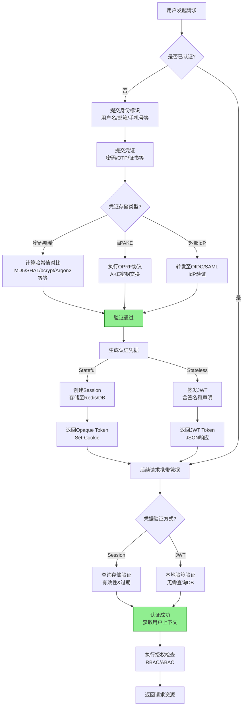

# 认证与授权
**认证（Authentication）** 与 **授权（Authorization）** 是两个部分（虽然都简写为Auth），分别解决“你是谁”和“你能做什么”的问题。

**认证** 是一个基础流程，即证明“我是我”的过程，而授权是基于认证流程的。

**授权** 一般针对于访问资源进行控制，例如你分享给别人的文件，用户A可以访问，而用户B不行。而对于本项目而言，由于每个玩家能且仅能访问自己的游戏数据，权限不容易变化，因此并不需要设计 **“授权”** 这一个流程，因此不用考虑授权，仅考虑认证。

## 认证、协议和密码学

### 认证流程
认证的一般流程可以概括为 `提交凭证 -> 验证身份 -> 颁发凭据 -> 凭据使用` ，流程图如下：

> **TIPS:** 上述的MD5、SHA1等由于安全性问题，不再推荐使用。

### 密码学
而现代密码学则提供数学工具和安全性证明，这些工具使得认证流程安全可信。
认证流程得以安全可信，离不开密码学提供的基础工具。

### 协议
认证协议的核心作用是将抽象的密码学算法编排成可交互、可验证的身份确认流程。

> **AI总结：** 认证是目的，认证协议是实现路径，密码学是路径的基石。

> **提示：** 本页部分内容由AI生成，请注意分辨

> **参见：**[认证](authentication.md)