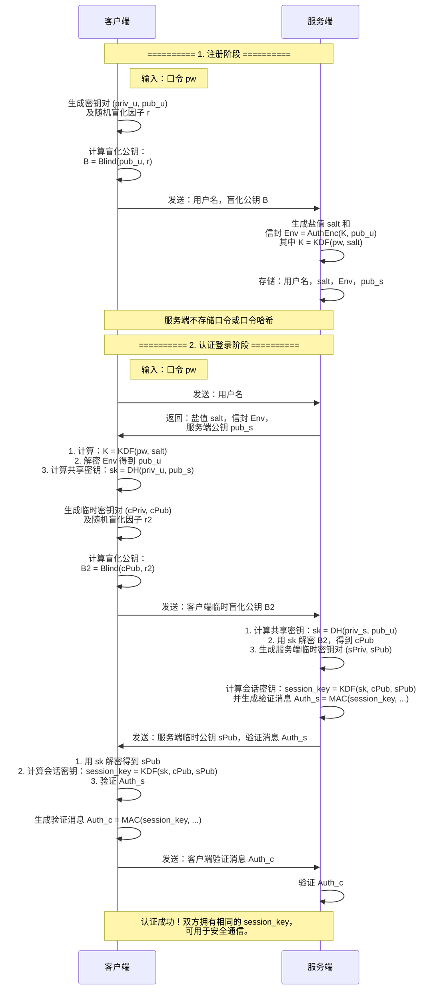

# OPAQUE协议

## 认证流程

```mermaid
sequenceDiagram
    participant C as 客户端
    participant S as 服务端

    Note over C,S: ========== 1. 注册阶段 ==========
    Note right of C: 输入：口令 pw
    C->>C: 生成密钥对 (priv_u, pub_u)<br/>及随机盲化因子 r
    C->>C: 计算盲化公钥：<br/>B = Blind(pub_u, r)
    C->>S: 发送：用户名，盲化公钥 B
    S->>S: 生成盐值 salt 和<br/>信封 Env = AuthEnc(K, pub_u)<br/>其中 K = KDF(pw, salt)
    S->>S: 存储：用户名，salt，Env，pub_s
    Note over C,S: 服务端不存储口令或口令哈希

    Note over C,S: ========== 2. 认证登录阶段 ==========
    Note right of C: 输入：口令 pw
    C->>S: 发送：用户名
    S->>C: 返回：盐值 salt，信封 Env，<br/>服务端公钥 pub_s
    C->>C: 1. 计算：K = KDF(pw, salt)<br/>2. 解密 Env 得到 pub_u<br/>3. 计算共享密钥：sk = DH(priv_u, pub_s)
    C->>C: 生成临时密钥对 (cPriv, cPub)<br/>及随机盲化因子 r2
    C->>C: 计算盲化公钥：<br/>B2 = Blind(cPub, r2)
    C->>S: 发送：客户端临时盲化公钥 B2
    S->>S: 1. 计算共享密钥：sk = DH(priv_s, pub_u)<br/>2. 用 sk 解密 B2，得到 cPub<br/>3. 生成服务端临时密钥对 (sPriv, sPub)
    S->>S: 计算会话密钥：session_key = KDF(sk, cPub, sPub)<br/>并生成验证消息 Auth_s = MAC(session_key, ...)
    S->>C: 发送：服务端临时公钥 sPub，验证消息 Auth_s
    C->>C: 1. 用 sk 解密得到 sPub<br/>2. 计算会话密钥：session_key = KDF(sk, cPub, sPub)<br/>3. 验证 Auth_s
    C->>C: 生成验证消息 Auth_c = MAC(session_key, ...)
    C->>S: 发送：客户端验证消息 Auth_c
    S->>S: 验证 Auth_c
    Note over C,S: 认证成功！双方拥有相同的 session_key，<br/>可用于安全通信。
```

由于OPAQUE基于[**零知识证明**](https://zhuanlan.zhihu.com/p/144847471)，因此可以确保密钥的绝对安全。