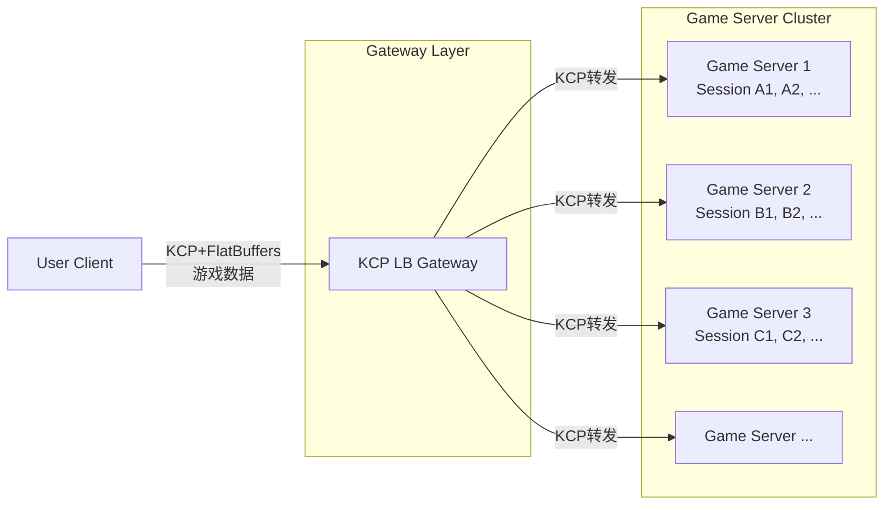

# 分布式系统

对于游戏服务器而言，需要支持横向扩展来应对弹性的用户需求。因此需要使用分布式系统。

## 架构设计
每次联机服务我们视为一个`Session`（或`Room`），我们将`Session`作为最小的计算单位，使得每个边缘服务可以同时处理至少一个`Session`，因此可以简单设计出以下架构：

通过一个负载均衡网关，可以将流量反向代理到多个边缘服务器。

对于本项目，这种简单的架构可以避免使用RPC（远程过程调用），简化架构。

## 网关
市面上有很多负载均衡器/反向代理/网关，例如Nginx、HAProxy、Cloudflare Pingora等等。但是这些都是适用于HTTP协议的，由于我们要使用KCP（约等于一种Stateful的UDP），因此上述的反向代理无法满足需求。

因此，我们可以自行实现一个负载均衡网关，基于KCP协议，实现负载均衡。

> **参见：** [网关设计](gateway.md)

## 消息队列
所使用的消息队列NATS本身支持分布式和集群，但本项目暂不考虑。
> **参见：** 
> - [消息队列](mq.md)
> - [外部文档：NATS与Docker](https://docs.nats.io/running-a-nats-service/nats_docker)