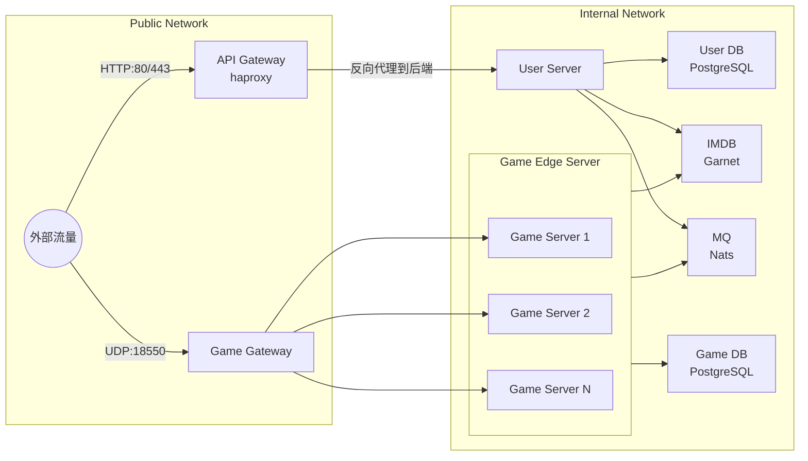

# 网关设计

对于HTTP请求而言，我们可以直接用现成的网关。

但是由于现有的产品无法对KCP这种Stateful UDP进行代理，因此需要自己实现一个负载均衡网关。

## 双网关架构
我们可以使用双网关架构，一个用于HTTP请求，一个用于KCP请求。

HTTP请求需要一个L7负载均衡器，常见的有Nginx、HAProxy等等。对于中小项目，Nginx完全够用，中大型项目可以考虑HAProxy。

> **笔记:** 与L7负载均衡概念相似的是L4负载均衡。分别对应的是OSI模型层级的第7层和第4层。

## 架构图

## HTTP网关

## KCP网关